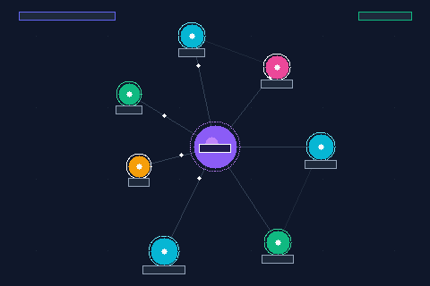

# VocabVault 🏛️
### Interactive Proto-Indo-European (PIE) Etymology & Adaptive Spaced-Repetition Engine

[](https://github.com/kohei519y-arch/vocab-vault/actions/workflows/deploy.yml)
[](LICENSE)
[](https://kohei519y-arch.github.io/vocab-vault/)
[](https://kohei519y-arch.github.io/vocab-vault/)

> **Stop atomized rote memorization.**  
> Master English vocabulary through its deep Proto-Indo-European root lineages, visualized in real-time physics spring networks and reinforced with mathematically optimal spaced repetition.

🌐 **Live Web Application**: [https://kohei519y-arch.github.io/vocab-vault/](https://kohei519y-arch.github.io/vocab-vault/)  
*(Zero sign-up required. 100% Client-Side & Local-First)*

---

## ⚡ Real-Time Etymology Spring Simulation



---

## ✨ Key Features

- 🧬 **Interactive PIE Root Network**:
  Visualizes ancient Proto-Indo-European root lineages (`*bʰer-`, `*kred-dʰē-`, `*sta-`) and how modern English words branched out. Powered by a high-performance 2D Canvas spring-embedder simulation with viewport culling.
- 🧠 **Adaptive Spaced Repetition (FSRS-4.5 & SM-2)**:
  Cognitive anchor bonuses give retention boosts to words deeply grounded in etymological roots.
- 📷 **Instant Camera OCR Vocabulary Capture**:
  Point your camera or upload book snapshots. Real-time client-side OCR (Tesseract.js) extracts terms directly into your flashcards.
- 🔁 **Bi-directional Knowledge Sync**:
  - **Anki (.tsv)**: 1-click export formatted with cloze, root tags, and pronunciation.
  - **Obsidian (Markdown)**: Generates bidirectional `[[wikilinks]]` to map into your PKM second brain.
- 🛡️ **Zero-Build, Pure Local-First Architecture**:
  Written in vanilla ES6+ with IndexedDB as Single Source of Truth (SSOT). Fully operational offline via Service Worker (PWA).

---

## 🚀 Quick Start

### 1. Web (No Install Needed)
Open [https://kohei519y-arch.github.io/vocab-vault/](https://kohei519y-arch.github.io/vocab-vault/) in any modern browser (desktop or mobile).

### 2. Local Development
```bash
# Clone the repository
git clone https://github.com/kohei519y-arch/vocab-vault.git
cd vocab-vault

# Start any static HTTP server (Python 3, Caddy, etc.)
python3 -m http.server 8000
```
Open `http://localhost:8000` in your browser. No `npm install`, no bundler build step!

---

## 🛠️ Architecture

```
vocab-vault/
├── index.html            # Production PWA Entrypoint (SEO, OGP & JSON-LD embedded)
├── css/
│   └── app.css           # Modern Dark Glassmorphism Design System
├── js/
│   ├── storage.js        # IndexedDB SSOT with 90-day Tombstone TTL & Vacuum
│   ├── anki.js           # FSRS-4.5 & SM-2 Spaced Repetition Engine
│   ├── graph.js          # Canvas 2D Spring Physics Simulation & Viewport Culling
│   ├── ocr.js            # Client-side Tesseract.js Image OCR Parser
│   ├── sync.js           # Bidirectional Cloud Synchronization
│   ├── starter_pack.js   # Built-in High-Yield PIE Root Dictionaries
│   └── app.js            # UI Navigation & Orchestration
├── assets/
│   └── demo-root-graph.gif # Generated Spring Physics Animation
├── docs/
│   ├── MARKETING_PLAYBOOK.md # Complete 30-Day Traction Strategy
│   └── marketing/        # Viral Threads, Product Hunt Kit, Outreach Templates
└── .github/workflows/
    └── deploy.yml        # Zero-Config GitHub Pages Auto-Deployment
```

---

## 📄 License
MIT © 2026 VocabVault Contributors
