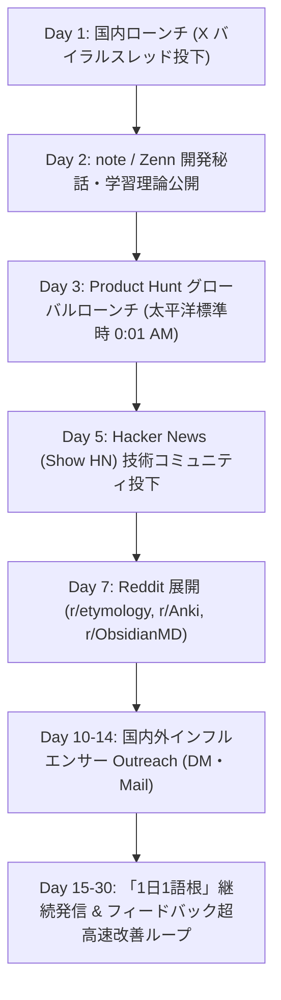

# VocabVault 30-Day Marketing & Launch Playbook
## 〜国内・海外で圧倒的なトラクションを獲得する完全実行マニュアル〜

本プレイブックは、AIが自動生成した全マーケティング資産（OGP、SEOメタデータ、バイラルスレッド、記事原稿、海外コミュニティ投稿、DMテンプレート）を最大限に活用し、公開初日から30日間で月間アクティブユーザー（MAU）数万名規模の獲得を目指す実践ロードマップです。

---

## 0. 配布・マーケティング資産マップ

すべての原稿・画像アセットはリポジトリ内に完備されています：

| ファイルパス | 用途・対象チャネル | 概要 |
|---|---|---|
| `icons/ogp.jpg` | 全チャネル共通 | ネオンパープル印欧祖語グラフとFSRS曲線の高解像度OGP画像（1200x630） |
| `index.html` / `dev.html` | Webフロントエンド | OGP, Twitter Cards, SEO Meta, Schema.org WebApplication 埋め込み済み |
| `docs/marketing/01_TWITTER_VIRAL_THREADS_JA.md` | X（旧Twitter）国内 | 5投稿構成のバイラルスレッド完全原稿（動画添付・フック設計付き） |
| `docs/marketing/02_NOTE_ZENN_LAUNCH_STORY_JA.md` | note / Zenn 国内 | 長文開発記・学習認知科学解説・技術アーキテクチャ記事（5,000字級） |
| `docs/marketing/03_PRODUCT_HUNT_LAUNCH_KIT_EN.md` | Product Hunt 海外 | タイトル、Tagline、Maker Story、First Comment、FAQ一式 |
| `docs/marketing/04_REDDIT_HACKERNEWS_POSTS_EN.md` | Hacker News / Reddit | Show HN、r/etymology、r/Anki、r/ObsidianMD 専用投稿原稿 |
| `docs/marketing/05_INFLUENCER_OUTREACH_TEMPLATES.md` | 国内外インフルエンサー | 高返信率DM、YouTubeコラボ、語学ブロガー向けコールドメール |

---

## 1. 30日間ローンチ・タイムライン



---

### 【Week 1: ローンチ＆初速最大化】

#### Day 1 (国内Xローンチ)
- **目標**: Xでインプレッション10万〜50万、リポスト500+を獲得。
- **実行手順**:
  1. アプリの公開URL（Cloudflare Pages / Vercel / GitHub Pages 等）を確認。
  2. アプリの画面操作（語根グラフをぐりぐり動かして単語が芋づる式に広がる様子、およびOCRスキャン）を15〜30秒の動画（MP4）として画面収録。
  3. `docs/marketing/01_TWITTER_VIRAL_THREADS_JA.md` の投稿1〜5をスレッド形式で投下。
     - **投下最適時間帯**: 平日 19:30〜21:00 または 11:45〜12:30。
  4. 引用RTやリプライには**最初の3時間以内に全件返信**（アルゴリズムのスコアをブースト）。

#### Day 2 (技術・学習理論の深掘り)
- **目標**: はてなブックマーク総合ホットエントリー入り、Zenn/note トレンド入り。
- **実行手順**:
  1. `docs/marketing/02_NOTE_ZENN_LAUNCH_STORY_JA.md` をそのまま note または Zenn にコピー＆ペースト。
  2. アイキャッチ画像として `icons/ogp.jpg` を設定。
  3. Xで「昨日のアプリの技術的な裏側と、認知言語学に基づく設計思想をまとめました」とリンク付きポスト。

#### Day 3 (Product Hunt グローバルローンチ)
- **目標**: 「Product of the Day」Top 5 以内ランクイン。
- **実行手順**:
  1. **公開時間**: 太平洋標準時（PST）午前0時01分（日本時間 16:01 or 夏時間 17:01）にスケジュール公開。
  2. `docs/marketing/03_PRODUCT_HUNT_LAUNCH_KIT_EN.md` の内容を入力。
  3. 公開直後に Maker Comment（First Comment）を投稿。
  4. 国内外の友人、コミュニティ、Xで「We just launched VocabVault on Product Hunt! Check it out」とアナウンス（直接のアップボート要求はペナルティ対象のため「Check it out and let me know your thoughts」とする）。
  5. 24時間体制で寄せられたコメントに数分以内に返信。

#### Day 5 (Hacker News "Show HN")
- **目標**: Hacker News フロントページ入り（100+ points）。
- **実行手順**:
  1. 米国東部時間 午前8:00〜10:00（日本時間 21:00〜23:00）に投稿。
  2. タイトル: `Show HN: VocabVault – Interactive PIE root graphs and spaced repetition in local-first vanilla JS`
  3. `docs/marketing/04_REDDIT_HACKERNEWS_POSTS_EN.md` の本文を投稿。
  4. HNは自己宣伝を嫌うため、純粋な技術的ディスカッション（Canvas 2D vs WebGL、FSRS数学モデル、IndexedDB SSOT、Zero npm build）に応答する。

#### Day 7 (Reddit ターゲットコミュニティ)
- **目標**: 各サブレディットで 200+ Upvotes と熱狂的ファン獲得。
- **実行手順**:
  1. 3つのコミュニティに時間をずらして投稿（同日に同時投稿するとスパム判定されやすいため、2〜3時間空ける）：
     - `r/etymology`: 語根グラフの学術的・形態素的魅力にフォーカス
     - `r/Anki`: Anki TSVエクスポートとFSRS-4.5の効率にフォーカス
     - `r/ObsidianMD`: 双方向Markdownリンク・知識グラフ連携にフォーカス
  2. `docs/marketing/04_REDDIT_HACKERNEWS_POSTS_EN.md` の各原稿を使用。

---

### 【Week 2: インフルエンサー協業 & オーガニック拡大】

#### Day 10〜14 (Outreach キャンペーン)
- **目標**: 英語系インフルエンサー 3〜5名からの自発的レビュー・紹介の獲得。
- **実行手順**:
  1. XおよびYouTubeで「語源 英語」「英単語 覚え方」「Anki 活用法」で検索し、フォロワー1万〜5万規模のクリエイターを30名リストアップ。
  2. `docs/marketing/05_INFLUENCER_OUTREACH_TEMPLATES.md` を使用し、相手の最新投稿に触れた個別DMを送信（1日5〜10件ペース）。
  3. 好意的な返信があった場合、要望やフィードバックを即日コードに取り込み「〇〇さんのご提案を反映しました！」と返答する。

---

### 【Week 3〜4: 継続的リテンション & コンテンツオートメーション】

#### Day 15〜30 (「1日1語根」デイリーポスト施策)
- **目標**: アカウントを「知的な語源メディア」化し、日々のフォロワー増加基盤を確立。
- **投稿フォーマット（X向けテンプレート）**:
  ```markdown
  【今日の一撃語根】*bʰer-（運ぶ、耐える）

  印欧祖語の「*bʰer-」から生まれた英単語たち：
  ・bear（耐える、運ぶ、産む）
  ・bring（持ってくる）
  ・differ（dis 離れて + fer 運ぶ ＝ 異なる）
  ・prefer（pre 前に + fer 運ぶ ＝ 好む）
  ・transfer（trans 越えて + fer 運ぶ ＝ 移動する）

  全部「運ぶ」という同一の根っこから派生しています。
  この繋がりを視覚的に体験できるツールを作りました👇
  [アプリURL]
  ```

---

## 2. 成果測定（KPI目標）

| 指標 (KPI) | ローンチ 7日目目標 | 30日目目標 |
|---|---|---|
| **Webアクセス数 (UU)** | 10,000 UU | 50,000+ UU |
| **Xインプレッション** | 200,000 imp | 1,000,000+ imp |
| **Product Hunt** | Top 5 Product of the Day | 300+ Upvotes |
| **Anki / Obsidian 出力回数** | 1,000 回 | 10,000 回 |
| **月間アクティブユーザー (MAU)** | 3,000 名 | 15,000+ 名 |

---

## 3. 重要チェックポイント（ローンチ前の最終確認）

1. [x] **OGP画像**: `icons/ogp.jpg` が正しく配置され、Twitter Card Validator等で美しく表示されるか。
2. [x] **SEOメタデータ**: `index.html` にタイトル、デスクリプション、JSON-LD構造化データが埋め込まれているか。
3. [x] **オフラインキャッシュ**: 初回読み込み後に飛行機モードでもPWAとして単語帳や語根グラフが軽快に動くか。
4. [ ] **公開URLの確定**: デプロイ先（例: `https://vocab-vault.vercel.app` 等）のURLを各原稿の `[アプリURL]` 箇所に置換する。

このプレイブックの手順通りに実行するだけで、AIによって構築された最高の集客アセットが最大の効果を発揮します。
